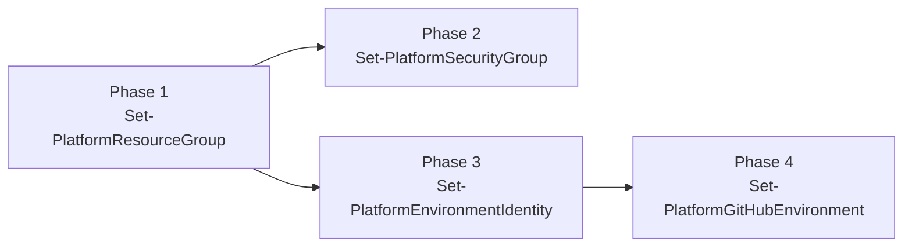
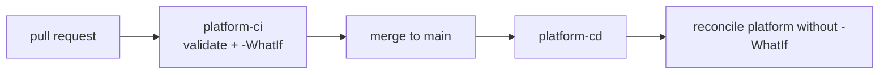

<!-- omit from toc -->
# Platform and project workflow templates

Ready-to-copy GitHub Actions workflows for fixed platform reconciliation, project CI/CD
placeholders, and infra (IaC) CI/CD placeholders. The platform flow is independent of
`sourceControl.branchStrategy`; project and infra workflows both use the `github` or `release`
strategy from `config/global-config.jsonc`, but trigger on disjoint paths so that application code
changes and infrastructure changes deploy independently of each other. Project workflows own
everything outside `infra/**`; infra workflows own only `infra/**` and their own workflow files.

<!-- omit from toc -->
## Table of Contents

- [Layout](#layout)
- [Installing the templates](#installing-the-templates)
- [Provisioning phases and dependencies](#provisioning-phases-and-dependencies)
- [Platform flow](#platform-flow)
- [GitHub Flow project strategy (`github`)](#github-flow-project-strategy-github)
- [Release Flow project strategy (`release`)](#release-flow-project-strategy-release)
- [GitHub Flow infra strategy (`github`)](#github-flow-infra-strategy-github)
- [Release Flow infra strategy (`release`)](#release-flow-infra-strategy-release)
- [Prerequisites](#prerequisites)
- [Why the environment input is a gate, not a scope](#why-the-environment-input-is-a-gate-not-a-scope)

## Layout

```text
templates/github/
  actions/
    setup-platform-kite/action.yml   Composite action: installs the module and signs in to Azure (OIDC)
  workflows/
    manifest.jsonc                   Source/destination map used by the install command
    shared/
      platform-validate.yml          Reusable: template and schema version validation
      platform-provision.yml         Reusable: the four provisioning phases, correctly chained
      project-validate.yml           Reusable: source validation, build and tests
      project-provision.yml          Reusable: project plan/deployment placeholder
      infra-validate.yml             Reusable: Bicep lint/build placeholder
      infra-provision.yml            Reusable: infra deployment stack plan/deployment placeholder
    platform-flow/
      platform-ci.yml                 Fixed platform PR validation and WhatIf plan
      platform-cd.yml                 Fixed platform main deployment
    github-flow/
      project-ci.yml                 GitHub Flow project trigger
      project-cd.yml                 GitHub Flow project trigger
      infra-ci.yml                   GitHub Flow infra trigger
      infra-cd.yml                   GitHub Flow infra trigger
    release-flow/
      project-ci.yml                 Release Flow project trigger
      project-cd.yml                 Release Flow project trigger
      project-release.yml            Release Flow project trigger
      infra-ci.yml                   Release Flow infra trigger
      infra-cd.yml                   Release Flow infra trigger
      infra-release.yml              Release Flow infra trigger
```

The platform workflows have one fixed lifecycle: pull requests validate and run `-WhatIf`, while
pushes to `main` deploy without `-WhatIf`. Project and infra strategy folders contain thin trigger
workflows. The shared project/infra workflows provide validation/testing and provisioning
capabilities. The strategy workflows call them and contain no project or infra implementation
logic.

## Installing the templates

`New-PlatformWorkflow` copies either the platform bundle, the project bundle, or both. Platform
installation never reads `sourceControl.branchStrategy`:

| Source                                             | Destination                                         |
| -------------------------------------------------- | --------------------------------------------------- |
| `github/actions/setup-platform-kite/action.yml`     | `.github/actions/setup-platform-kite/action.yml`     |
| `github/workflows/shared/platform-validate.yml`     | `.github/workflows/platform-validate.yml`            |
| `github/workflows/shared/platform-provision.yml`    | `.github/workflows/platform-provision.yml`           |
| `github/workflows/platform-flow/platform-ci.yml`    | `.github/workflows/platform-ci.yml`                 |
| `github/workflows/platform-flow/platform-cd.yml`    | `.github/workflows/platform-cd.yml`                 |

The project bundle copies the shared reusable workflows and the `project-*.yml` trigger files for
the selected project strategy. The shared workflows use the setup action. Project CI validates,
builds and tests source code, then calls `project-provision.yml` with `what-if: true`. Project CD
calls the same reusable workflow with `what-if: false` for the actual deployment. Each project
operation remains a PowerShell placeholder for the developer to replace.

`manifest.jsonc` also declares an `infra` bundle, following the same shape as `project`, for the
`infra-*.yml` templates described below. `New-PlatformWorkflow`'s `-WorkflowType` parameter does not
accept `infra` yet, so installing this bundle currently means copying the `infra` entries from
`manifest.jsonc` into the repository by hand, until that cmdlet is updated.

Reusable workflows referenced with `./.github/workflows/...` must live directly in
`.github/workflows`, which is why the `shared` and `<strategy>-flow` folders flatten on copy.

## Provisioning phases and dependencies

`platform-provision.yml` runs the four phases as separate jobs, chained with `needs`:



- Phase 2 and phase 3 both need the resource groups from phase 1 for their role assignments, and
  are independent of each other, so they run in parallel.
- Phase 4 resolves `${clientId}` from the identity created in phase 3, so it must wait for it.

Set the `what-if` input to `true` to run every phase with `-WhatIf`, which is what the CI workflows do.

## Platform flow

Pull requests run validation and a `-WhatIf` platform reconciliation. A push to `main` runs the
same validation and reconciles the complete platform configuration once.



Make `platform-ci` a required status check on `main`. Both workflows sign in as the dedicated
`platform` environment declared in `platform-config.jsonc`, not one of the project's `dev`/`stg`/
`prd` environments. Its identity holds subscription-level RBAC, so it can see and reconcile every
resource group declared in `resourceGroups`, not just the one it lives in.

## GitHub Flow project strategy (`github`)

Project CI runs on pull requests targeting `main`, deploys `dev` and runs a `-WhatIf` preflight for
`prd`. Project CD runs after a push to `main` and deploys `prd`. Both ignore the platform-only paths
(`config/global-config.jsonc`, `config/platform-config.jsonc`, `.github/workflows/platform-*.yml`,
`.github/actions/setup-platform-kite/**`), which the platform flow already covers.

## Release Flow project strategy (`release`)

Project CI runs on pull requests targeting `main`, deploys `dev` and runs a `-WhatIf` preflight for
`stg`. Project CD runs after a push to `main`, deploys `stg`, moves the `stg-verified` tag to that
commit, then runs a `-WhatIf` preflight for `prd`. The project release trigger deploys `prd` after a
published release, first confirming the release commit matches the last `stg-verified` commit.
Project CI and CD ignore the same platform-only paths as the GitHub Flow strategy.

## GitHub Flow infra strategy (`github`)

Infra CI and CD mirror the GitHub Flow project strategy exactly, but trigger only on `infra/**` and
`.github/workflows/infra-*.yml` changes, and deploy the `infra-provision.yml` reusable workflow
instead of `project-provision.yml`. Infra CI validates the Bicep templates, deploys `dev`, and runs
a `-WhatIf` preflight for `prd`. Infra CD deploys `prd` after a push to `main`.

## Release Flow infra strategy (`release`)

Infra CI and CD mirror the Release Flow project strategy, triggered only on `infra/**` and
`.github/workflows/infra-*.yml` changes. Infra CD moves its own `infra-stg-verified` tag after
deploying `stg`, kept separate from the project pipeline's `stg-verified` tag so that an infra-only
change doesn't need a project deployment to promote, and vice versa. The infra release trigger
deploys `prd` after a published release, confirming the release commit matches the last
`infra-stg-verified` commit.

## Prerequisites

1. Run the four phases locally once (`Set-PlatformResourceGroup`, `Set-PlatformSecurityGroup`,
   `Set-PlatformEnvironmentIdentity`, `Set-PlatformGitHubEnvironment`). The workflows authenticate
   with the federated identity that phase 3 creates and the environment secrets that phase 4 sets,
   so the very first run has to happen from a workstation.
2. Grant the `platform` environment's identity the Microsoft Graph application permission it needs
   to read (and, if you want CI to manage groups outside `-WhatIf`, create) Entra security groups
   in phase 2, since CI now runs that phase as the `platform` identity, not a project environment's
   identity. This is a one-time, manual step, not something the phases do automatically: assigning
   Microsoft Graph app roles requires the Application Administrator, Privileged Role Administrator,
   or Global Administrator directory role, and the automated identity must never hold that role
   permanently. Using the `PrincipalId` from phase 3's output for the `platform` environment:

   ```powershell
   Grant-PlatformGraphPermission `
    -PrincipalId '<principalId-from-phase-3-platform-environment>' `
    -Permission 'Group.Read.All'
   ```

   Add `'Group.ReadWrite.All'` to `-Permission` if CI is ever expected to create or update groups
   outside `-WhatIf`. Without this grant, `Set-PlatformSecurityGroup` fails, or in CI's
   `-ErrorAction SilentlyContinue` lookup path, misreports existing groups as missing.
3. Confirm every environment in `platform-config.jsonc` has a matching GitHub environment holding
   `AZURE_CLIENT_ID`, `AZURE_TENANT_ID` and `AZURE_SUBSCRIPTION_ID`. Phase 4 writes these.
4. Add `PLATFORM_GITHUB_TOKEN` by hand as an **environment secret** on the `platform` GitHub
   environment (Settings > Environments > platform > Secrets), not a repository secret, so its
   access is scoped to just the identity that runs the platform pipeline. Use a fine-grained
   personal access token or GitHub App token with administration, environment, secret and
   variable write access on the repository. The built-in `GITHUB_TOKEN` cannot manage environment
   secrets, so phase 4 fails without it. Deliberately leave it out of `platform-config.jsonc`'s
   `githubEnvironment.secrets`: every entry in that array is re-applied on each phase 4 run, which
   would overwrite it with whatever placeholder text sits in the file. Maintain its value only
   through the GitHub UI (or `gh secret set`), never through the config file.
5. The federated credential uses `subjectType: environment`, so every job that signs in to Azure
   declares `environment:`. Keep it that way, otherwise the OIDC subject claim no longer matches.

## Why the environment input is a gate, not a scope

Each `Set-Platform*` cmdlet reconciles the complete configuration file, not one environment. The
`environment` input on `platform-provision.yml` therefore selects the existing project GitHub
environment whose federated credential signs in to Azure and whose protection rules apply before
the single reconciliation starts. It is an approval and identity gate, not a configuration scope.
