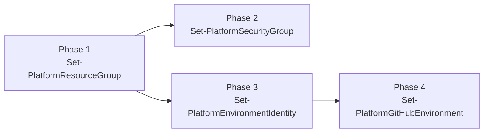
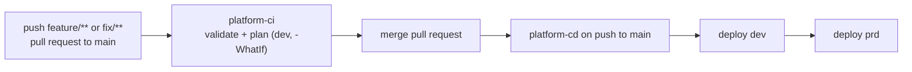
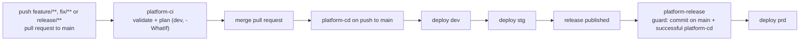

<!-- omit from toc -->
# Platform workflow templates

Ready-to-copy GitHub Actions workflows that provision `config/platform-config.jsonc` end to end.
Pick the `github-flow` or `release-flow` folder for the `sourceControl.branchStrategy` value in your
`config/global-config.jsonc`.

<!-- omit from toc -->
## Table of Contents

- [Layout](#layout)
- [Installing the templates](#installing-the-templates)
- [Provisioning phases and dependencies](#provisioning-phases-and-dependencies)
- [GitHub Flow strategy (`github`)](#github-flow-strategy-github)
- [Release strategy (`release`)](#release-strategy-release)
- [Prerequisites](#prerequisites)
- [Why the environment input is a gate, not a scope](#why-the-environment-input-is-a-gate-not-a-scope)

## Layout

```text
templates/github/
  actions/
    setup-platform-kite/action.yml   Composite action: installs the module and signs in to Azure (OIDC)
  workflows/
    manifest.jsonc                   Source/destination map used by the install command
    shared/
      platform-validate.yml          Reusable: template and schema version validation
      platform-provision.yml         Reusable: the four provisioning phases, correctly chained
    github-flow/
      platform-ci.yml                CI: feature/fix branches and pull requests to main
      platform-cd.yml                CD: push to main, dev then prd
    release-flow/
      platform-ci.yml                CI: feature/fix/release branches and pull requests to main
      platform-cd.yml                CD: push to main, dev then stg
      platform-release.yml           Release published, prd
```

The two strategy folders contain only thin caller workflows. All logic lives in the two reusable
workflows in `shared/` and in the composite action, so both strategies stay in sync.

## Installing the templates

Copy the `shared` files plus the files for your strategy into the target repository, following
`manifest.jsonc`:

| Source                                             | Destination                                         |
| -------------------------------------------------- | --------------------------------------------------- |
| `github/actions/setup-platform-kite/action.yml`     | `.github/actions/setup-platform-kite/action.yml`     |
| `github/workflows/shared/platform-validate.yml`     | `.github/workflows/platform-validate.yml`            |
| `github/workflows/shared/platform-provision.yml`    | `.github/workflows/platform-provision.yml`           |
| `github/workflows/<strategy>-flow/platform-*.yml`   | `.github/workflows/platform-*.yml`                   |

Reusable workflows referenced with `./.github/workflows/...` must live directly in
`.github/workflows`, which is why the `shared` and `<strategy>-flow` folders flatten on copy.

## Provisioning phases and dependencies

`platform-provision.yml` runs the four phases as separate jobs, chained with `needs`:



- Phase 2 and phase 3 both need the resource groups from phase 1 for their role assignments, and
  are independent of each other, so they run in parallel.
- Phase 4 resolves `${clientId}` from the identity created in phase 3, so it must wait for it.

Set the `what-if` input to `true` to run every phase with `-WhatIf`, which is what the CI workflows do.

## GitHub Flow strategy (`github`)

Two environments: `dev` and `prd`.



Make `platform-ci` a required status check on `main` so a pull request can only be merged after CI
has succeeded on the feature or fix branch, and add required reviewers to the `prd` environment to
gate the promotion.

## Release strategy (`release`)

Three environments: `dev`, `stg` and `prd`.



Production is never reached by merging alone. `platform-release` first verifies that the released
commit is contained in `main` and that a successful `platform-cd` run exists for that exact commit,
so `dev` and `stg` are always provisioned first.

## Prerequisites

1. Run the four phases locally once (`Set-PlatformResourceGroup`, `Set-PlatformSecurityGroup`,
   `Set-PlatformEnvironmentIdentity`, `Set-PlatformGitHubEnvironment`). The workflows authenticate
   with the federated identity that phase 3 creates and the environment secrets that phase 4 sets,
   so the very first run has to happen from a workstation.
2. Confirm every environment in `platform-config.jsonc` has a matching GitHub environment holding
   `AZURE_CLIENT_ID`, `AZURE_TENANT_ID` and `AZURE_SUBSCRIPTION_ID`. Phase 4 writes these.
3. Add a repository or environment secret named `PLATFORM_GITHUB_TOKEN`, a fine-grained personal
   access token or GitHub App token with administration, environment, secret and variable write
   access on the repository. The built-in `GITHUB_TOKEN` cannot manage environment secrets, so
   phase 4 fails without it.
4. The federated credential uses `subjectType: environment`, so every job that signs in to Azure
   declares `environment:`. Keep it that way, otherwise the OIDC subject claim no longer matches.

## Why the environment input is a gate, not a scope

Each `Set-Platform*` cmdlet reconciles the complete configuration file, not one environment. The
`environment` input on `platform-provision.yml` therefore selects which federated credential signs
in to Azure and which protection rules apply before the phases start. Staging the workflow across
`dev`, `stg` and `prd` gives you progressive approval gates, while every stage converges the same
declared end state.
