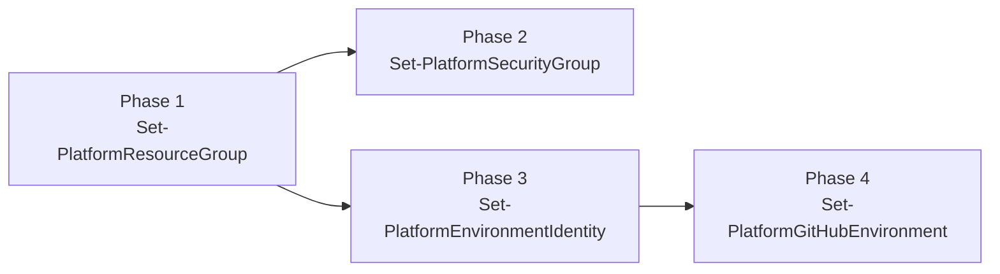
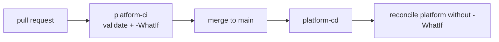

<!-- omit from toc -->
# Platform, workload, and infra workflow templates

Ready-to-copy GitHub Actions workflows for fixed platform reconciliation, workload (application/
service/solution code) CI/CD placeholders, and infra (IaC) CI/CD placeholders. The platform flow
is independent of `sourceControl.branchStrategy`; workload and infra workflows both use the `github`
or `release` strategy from `config/global-config.jsonc`, but trigger on disjoint paths so that
application code changes and infrastructure changes deploy independently of each other.
Workload code lives under `src/`; infra (IaC) code lives under `iac/res/`. Each strategy triggers
only on its own folder (plus its own workflow files): workload workflows trigger on `src/**`,
infra workflows trigger on `iac/**`.

<!-- omit from toc -->
## Table of Contents

- [Layout](#layout)
- [Installing the templates](#installing-the-templates)
- [Provisioning phases and dependencies](#provisioning-phases-and-dependencies)
- [Workload and infra identity split](#workload-and-infra-identity-split)
- [Platform flow](#platform-flow)
- [GitHub Flow workload strategy (`github`)](#github-flow-workload-strategy-github)
- [Release Flow workload strategy (`release`)](#release-flow-workload-strategy-release)
- [GitHub Flow infra strategy (`github`)](#github-flow-infra-strategy-github)
- [Release Flow infra strategy (`release`)](#release-flow-infra-strategy-release)
- [Manual runs and concurrency](#manual-runs-and-concurrency)
- [Prerequisites](#prerequisites)
- [Why the environment input is a gate, not a scope](#why-the-environment-input-is-a-gate-not-a-scope)

## Layout

```text
templates/github/
  actions/
    setup-platform-kite/action.yml   Composite action: installs the module and signs in to Azure (OIDC)
  workflows/
    manifest.jsonc                   Source/destination map used by the install command
    shared/
      platform-validate.yml          Reusable: template and schema version validation
      platform-provision.yml         Reusable: the four provisioning phases, correctly chained
      workload-validate.yml          Reusable: source validation, build and tests
      workload-provision.yml         Reusable: workload plan/deployment placeholder
      infra-validate.yml             Reusable: Bicep lint/build placeholder
      infra-provision.yml            Reusable: infra deployment stack plan/deployment placeholder
    platform-flow/
      platform-ci.yml                 Fixed platform PR validation and WhatIf plan
      platform-cd.yml                 Fixed platform main deployment
    github-flow/
      workload-ci.yml                GitHub Flow workload trigger
      workload-cd.yml                GitHub Flow workload trigger
      infra-ci.yml                   GitHub Flow infra trigger
      infra-cd.yml                   GitHub Flow infra trigger
    release-flow/
      workload-ci.yml                Release Flow workload trigger
      workload-cd.yml                Release Flow workload trigger
      workload-release.yml           Release Flow workload trigger
      infra-ci.yml                   Release Flow infra trigger
      infra-cd.yml                   Release Flow infra trigger
      infra-release.yml              Release Flow infra trigger
```

The platform workflows have one fixed lifecycle: pull requests validate and run `-WhatIf`, while
pushes to `main` deploy without `-WhatIf`. Workload and infra strategy folders contain thin trigger
workflows. The shared workload/infra workflows provide validation/testing and provisioning
capabilities. The strategy workflows call them and contain no workload or infra implementation
logic.

## Installing the templates

`New-PlatformWorkflow` copies the platform bundle, the workload bundle, the infra bundle, or a
combination via `-WorkflowType`: `platform`, `workload`, `infra`, `both` (platform + workload, the
default), or `all` (platform + workload + infra). Platform installation never reads
`sourceControl.branchStrategy`:

| Source                                             | Destination                                         |
| -------------------------------------------------- | --------------------------------------------------- |
| `github/actions/setup-platform-kite/action.yml`     | `.github/actions/setup-platform-kite/action.yml`     |
| `github/workflows/shared/platform-validate.yml`     | `.github/workflows/platform-validate.yml`            |
| `github/workflows/shared/platform-provision.yml`    | `.github/workflows/platform-provision.yml`           |
| `github/workflows/platform-flow/platform-ci.yml`    | `.github/workflows/platform-ci.yml`                 |
| `github/workflows/platform-flow/platform-cd.yml`    | `.github/workflows/platform-cd.yml`                 |

The workload bundle copies the shared reusable workflows and the `workload-*.yml` trigger files for
the selected branch strategy. The shared workflows use the setup action. Workload CI validates,
builds and tests source code, then calls `workload-provision.yml` with `what-if: true`. Workload CD
calls the same reusable workflow with `what-if: false` for the actual deployment. Each workload
operation remains a PowerShell placeholder for the developer to replace.

`manifest.jsonc` also declares an `infra` bundle, following the same shape as `workload`, for the
`infra-*.yml` templates described below. Pass `-WorkflowType infra` (or `-BranchStrategy` explicitly)
to install just that bundle, or `-WorkflowType all` to install platform, workload, and infra together.
Infra and workload share the same `-BranchStrategy`/`sourceControl.branchStrategy` value, since both
follow the same promotion strategy (`github` or `release`).

The infra bundle also copies a starter Bicep sample under `iac/res/sample/`: `main.bicep`, its
`types/main.bicep` import, per-environment `params/*.bicepparam` files, and `deploy.ps1`, the script
that `infra-provision.yml` invokes to create or update the Azure Deployment Stack. Unlike the
workflow files, these copy to their own path at the repo root rather than flattening into
`.github/workflows`, so `infra-ci.yml`/`infra-cd.yml` have something real to lint, build, and deploy
out of the box. The empty `iac/res/sample/modules/` folder is included too, as a placeholder for
custom Bicep modules.

Reusable workflows referenced with `./.github/workflows/...` must live directly in `.github/workflows`,
which is why the `shared` and `<strategy>-flow` folders flatten on copy.

## Provisioning phases and dependencies

`platform-provision.yml` runs the four phases as separate jobs, chained with `needs`:


```mermaid
flowchart LR
  P1["Phase 1<br/>Set-PlatformResourceGroup"] --> P2["Phase 2<br/>Set-PlatformSecurityGroup"]
  P1 --> P3["Phase 3<br/>Set-PlatformEnvironmentIdentity"]
  P3 --> P4["Phase 4<br/>Set-PlatformGitHubEnvironment"]
```

- Phase 2 and phase 3 both need the resource groups from phase 1 for their role assignments,
  and are independent of each other, so they run in parallel.
- Phase 4 resolves `${clientId}` from the identity created in phase 3, so it must wait for it.

Set the `what-if` input to `true` to run every phase with `-WhatIf`, which is what the CI workflows do.

## Workload and infra identity split

Each `dev`/`stg`/`prd` environment in `platform-config.jsonc` can declare two identities instead of
one: `userAssignedIdentity` (paired with `githubEnvironment`, named e.g. `dev-infra`) and an optional
`workloadUserAssignedIdentity` (paired with `workloadGithubEnvironment`, named e.g. `dev-workload`).
Phases 3 and 4 process both when the workload pair is present.

- **Infra identity** (`userAssignedIdentity`): broader rights, including `Azure Deployment Stack Contributor`,
  so it can create, update, and delete resources through a deployment stack. Used by the `infra-*.yml` workflows,
  which sign in with `environment: dev-infra`.
- **Workload identity** (`workloadUserAssignedIdentity`): narrower rights, `Contributor` only, no
  deployment-stack role, so pushing application/service/solution code cannot alter infrastructure through
  this identity. Used by the `workload-*.yml` workflows, which sign in with `environment: dev-workload`.

Both suffixes name the GitHub environment (and, through the OIDC `environment` subject, the
federated credential) only. `environmentCode` (`dev`, `stg`, `prd`) stays unsuffixed everywhere else:
resource group ids, Azure resource names, and the `ENV_CODE` environment variable that
`platform-config.jsonc` sets on the `githubEnvironment`, which `infra-provision.yml` reads
via `vars.ENV_CODE` instead of deriving it from the (now `-infra`-suffixed) `environment` input.

This is what actually enforces "developers deploy code, platform/cloud engineers deploy
infrastructure": two separate GitHub environments with two separate federated identities, not just two
separate workflow files. Declaring `workloadUserAssignedIdentity` without
`workloadGithubEnvironment` (or the reverse) is rejected, since their secrets would otherwise
collide with the infra environment's. Omitting both is still valid: the environment then has a
single identity for both pipelines, as before.

## Platform flow

Pull requests run validation and a `-WhatIf` platform reconciliation. A push to `main` runs the same validation and reconciles the complete platform configuration once.


```mermaid
flowchart LR
  PR["pull request"] --> CI["platform-ci<br/>validate + -WhatIf"]
  CI --> M["merge to main"]
  M --> CD["platform-cd"]
  CD --> D["reconcile platform without -WhatIf"]
```

Make `platform-ci` a required status check on `main`. The two workflows sign in with different
identities, both declared in `platform-config.jsonc` rather than being one of the workload's `dev`/
`stg`/`prd` environments:

| Workflow | GitHub environment | Identity rights | Who may use it |
| --- | --- | --- | --- |
| `platform-cd` | `platform` | `Contributor` + `User Access Administrator` on the subscription | Runs from `main` only (`deploymentBranchPolicy`) |
| `platform-ci` | `platform-plan` | `Reader` on the subscription | Any branch, including pull requests |

A `-WhatIf` run of the four phases only reads, so the plan identity never needs write access. This
keeps the subscription-wide identity out of reach of pull requests: a workflow edited in a pull
request can request the `platform-plan` environment, but GitHub refuses to hand out the `platform`
environment's OIDC token or secrets to any run that is not on `main`.

## GitHub Flow workload strategy (`github`)

Workload CI runs on pull requests targeting `main`, deploys `dev` and runs a `-WhatIf` preflight for
`prd`. Workload CD runs after a push to `main` and deploys `prd`. Both trigger only on `src/**` and
`.github/workflows/workload-*.yml` changes, so platform and infra changes never run the workload
pipeline.

## Release Flow workload strategy (`release`)

Workload CI runs on pull requests targeting `main`, deploys `dev` and runs a `-WhatIf` preflight for
`stg`. Workload CD runs after a push to `main`, deploys `stg`, moves the `stg-workload-verified` tag
to that commit, then runs a `-WhatIf` preflight for `prd`. The workload release trigger deploys `prd`
after a published release, first confirming the release commit is an ancestor of (or equal to) the
`stg-workload-verified` commit, not necessarily the exact tip. Since `main` only moves forward and
`stg-workload-verified` only ever advances to a newer commit, any commit that has already reached
`stg` passes this check even if a later commit was promoted in the meantime, for example while an
older release is still waiting to be published. An exact-equality check would fail that release for
no reason: the tag can legitimately move past the released commit between release creation and the
release trigger running. Since the `release` event has no tag pattern filter, the workload release
trigger runs for every published release but only proceeds when the release tag starts with
`workload/`, for example `workload/v1.2.0`; releases tagged `infra/...` are skipped.
Workload CI and CD trigger only on the same `src/**` allowlist as the GitHub Flow strategy.

## GitHub Flow infra strategy (`github`)

Infra CI and CD mirror the GitHub Flow workload strategy exactly, but trigger only on `iac/**`
and `.github/workflows/infra-*.yml` changes, and deploy the `infra-provision.yml` reusable workflow
instead of `workload-provision.yml`, signing in to the `dev-infra`/`stg-infra`/`prd-infra` GitHub
environments instead of their `-workload` counterparts. Infra CI validates the Bicep templates,
deploys `dev`, and runs a `-WhatIf` preflight for `prd`. Infra CD deploys `prd` after a push to
`main`.

## Release Flow infra strategy (`release`)

Infra CI and CD mirror the Release Flow workload strategy, triggered only on `iac/**` and
`.github/workflows/infra-*.yml` changes. Infra CD moves its own `stg-infra-verified` tag after
deploying `stg`, kept separate from the workload pipeline's `stg-workload-verified` tag so that an
infra-only change doesn't need a workload deployment to promote, and vice versa. The infra release
trigger deploys `prd` after a published release, confirming the release commit is an ancestor of (or
equal to) the `stg-infra-verified` commit, using the same ancestor check as the workload release
trigger and for the same reason: the tag can move on before an older release is published. Just like
the workload release trigger, it only proceeds when the release tag starts with `infra/`, for
example `infra/v1.2.0`; releases tagged `workload/...` are skipped.

## Manual runs and concurrency

Every workflow keeps a `workflow_dispatch` trigger, but a manual run can never deploy something
the automatic trigger would not:

- **CD workflows** (`*-cd.yml`) only deploy when run from `main`. A manual run from any other branch
  skips every deploy job, so a feature branch can never reach `stg` or `prd`, nor move a
  `stg-*-verified` tag.
- **Release workflows** (`*-release.yml`) take a required `tag` input, for example `infra/v1.2.0`,
  to redeploy an existing release to `prd` (e.g. after a failed run). The manual run goes through the
  same staging verification as a published release, and `deploy-prd` only runs when that
  verification succeeded, deploying exactly the verified tag.

CI workflows cancel an outdated run when a branch receives a new commit, since a newer plan
supersedes the old one. Deploying workflows (CD, release, and platform CD) never cancel a run that
is in progress: a deployment stack or RBAC reconciliation stopped halfway can leave Azure partially
updated. A newer run waits instead. GitHub keeps at most one waiting run per concurrency group, so a
third run replaces the waiting one; that is safe, because the newest commit on `main` includes the
older ones.

## Prerequisites

1. Run the four phases locally once (`Set-PlatformResourceGroup`, `Set-PlatformSecurityGroup`,
   `Set-PlatformEnvironmentIdentity`, `Set-PlatformGitHubEnvironment`). The workflows authenticate
   with the federated identity that phase 3 creates and the environment secrets that phase 4 sets,
   so the very first run has to happen from a workstation.
2. Grant the `platform` environment's identity the Microsoft Graph application permission it needs
   to read (and, if you want CI to manage groups outside `-WhatIf`, create) Entra security groups
   in phase 2, since CI now runs that phase as the `platform` identity, not a workload environment's
   identity. This is a one-time, manual step, not something the phases do automatically: assigning
   Microsoft Graph app roles requires the Application Administrator, Privileged Role Administrator,
   or Global Administrator directory role, and the automated identity must never hold that role
   permanently. Using the `PrincipalId` from phase 3's output for the `platform` environment:

   ```powershell
   Grant-PlatformGraphPermission `
    -PrincipalId '<principalId-from-phase-3-platform-environment>' `
    -Permission 'Group.Read.All'
   ```

   Add `'Group.ReadWrite.All'` to `-Permission` if CI is ever expected to create or update groups
   outside `-WhatIf`. Without this grant, `Set-PlatformSecurityGroup` fails, or in CI's
   `-ErrorAction SilentlyContinue` lookup path, misreports existing groups as missing.

   Grant the `platform-plan` identity (`Platform (plan)` in phase 3's output) `Group.Read.All` as
   well, and never more: `platform-ci` runs phase 2 as that identity on pull requests.
3. Confirm every environment in `platform-config.jsonc` has a matching GitHub environment holding
   `AZURE_CLIENT_ID`, `AZURE_TENANT_ID` and `AZURE_SUBSCRIPTION_ID`. Phase 4 writes these. The
   `infra-*.yml` workflows sign in to the `-infra`-suffixed environment (e.g. `dev-infra`). If an
   environment declares `workloadUserAssignedIdentity`/`workloadGithubEnvironment`, confirm the
   `-workload`-suffixed environment (e.g. `dev-workload`) exists too; the `workload-*.yml` workflows
   sign in to that one instead.
4. Add `PLATFORM_GITHUB_TOKEN` by hand as an **environment secret** on the `platform` GitHub
   environment (Settings > Environments > platform > Secrets), not a repository secret, so its
   access is scoped to just the identity that runs the platform pipeline. Use a fine-grained
   personal access token or GitHub App token with administration, environment, secret and
   variable write access on the repository. The built-in `GITHUB_TOKEN` cannot manage environment
   secrets, so phase 4 fails without it. Deliberately leave it out of `platform-config.jsonc`'s
   `githubEnvironment.secrets`: every entry in that array is re-applied on each phase 4 run, which
   would overwrite it with whatever placeholder text sits in the file. Maintain its value only
   through the GitHub UI (or `gh secret set`), never through the config file.

   Add a **second, read-only** token under the same name, `PLATFORM_GITHUB_TOKEN`, as an environment
   secret on the `platform-plan` environment: a fine-grained personal access token limited to this
   repository with **read-only** access to actions, administration, environments, secrets, and
   variables. Phase 4 under `-WhatIf` only lists environments, branch policies, secrets, and
   variables, so the read-only token is enough, and a pull request can never use it to change them.
5. The `platform` environment only accepts runs from `main` (its `deploymentBranchPolicy`), so the
   first pull request that adds `platform-plan` cannot create it through `platform-ci`. Create it
   from your workstation as in step 1 (phases 3 and 4), then complete steps 2 and 4 for it before
   opening that pull request.
6. The federated credential uses `subjectType: environment`, so every job that signs in to Azure
   declares `environment:`. Keep it that way, otherwise the OIDC subject claim no longer matches.

## Why the environment input is a gate, not a scope

Each `Set-Platform*` cmdlet reconciles the complete configuration file, not one environment. The
`environment` input on `platform-provision.yml` therefore selects the existing workload GitHub
environment whose federated credential signs in to Azure and whose protection rules apply before
the single reconciliation starts. It is an approval and identity gate, not a configuration scope.
